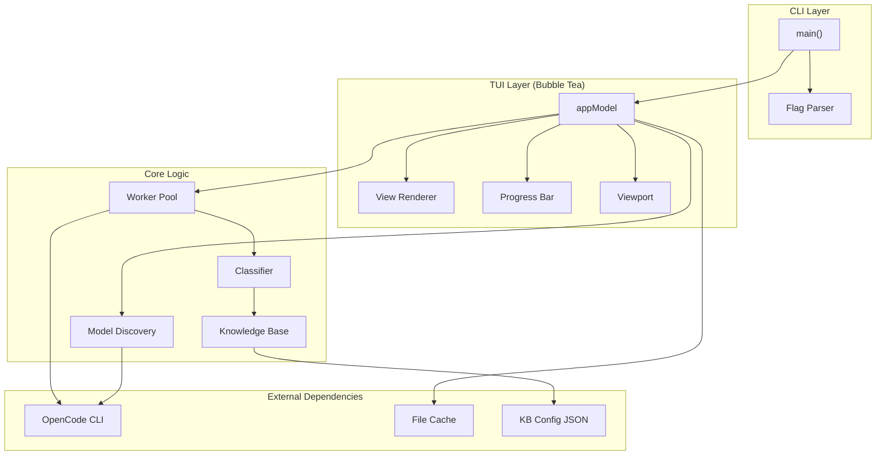
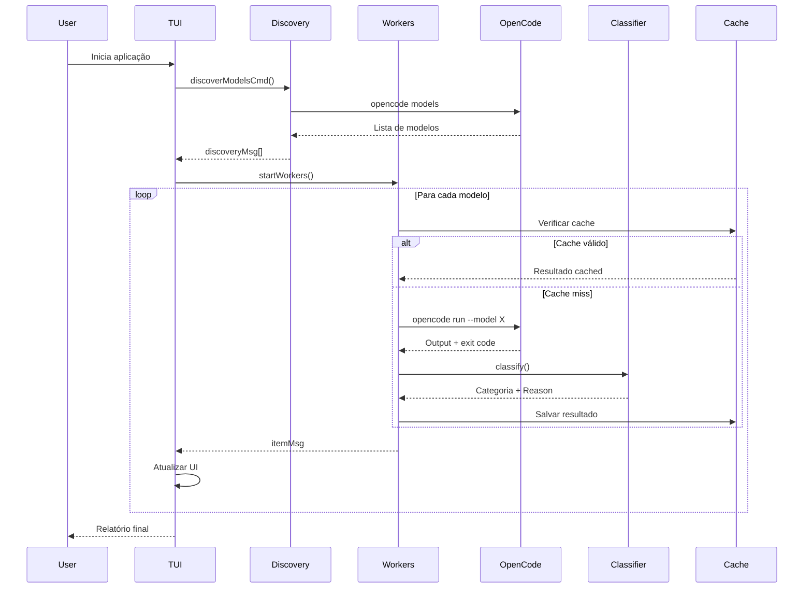

# Arquitetura - OpenCode Check

## Diagrama de Componentes



## Fluxo de Dados



## Estrutura de Dados

### ModelResult
```go
type ModelResult struct {
    Model      string  // "provider/model-name"
    Provider   string  // "opencode", "groq", etc.
    Category   string  // FREE, TIMEOUT, etc.
    Reason     string  // Descrição legível
    Duration   string  // "1.234s"
    DurationMs int64   // 1234
    Output     string  // Resposta truncada
    ExitCode   int     // 0 = sucesso
    Icon       string  // Emoji da categoria
    Timestamp  string  // RFC3339
}
```

### Categorias

```
┌────────────────┬──────┬─────────────────────────────────┐
│ Categoria      │ Icon │ Significado                     │
├────────────────┼──────┼─────────────────────────────────┤
│ FREE           │ 🆓   │ Gratuito sem limites            │
│ FREE_LIMITED   │ 📊   │ Gratuito com quotas             │
│ PAID_ZAI_OK    │ 💎   │ Pago ZAI ativo                  │
│ AVAILABLE      │ ✅   │ Disponível (outros)             │
│ NOT_FOUND      │ ❓   │ Modelo não existe               │
│ TIMEOUT        │ ⏰   │ Timeout (20s)                   │
│ AUTH_FAILED    │ 🔒   │ API key inválida                │
│ NO_QUOTA       │ ❌   │ Sem créditos                    │
│ RATE_LIMITED   │ ⏱️   │ Rate limit atingido             │
│ ERROR          │ ⚠️   │ Erro desconhecido               │
└────────────────┴──────┴─────────────────────────────────┘
```

## Dependências

| Pacote | Versão | Uso |
|--------|--------|-----|
| bubbletea | v1.3.10 | Framework TUI |
| bubbles | v0.21.1 | Componentes (progress, viewport) |
| lipgloss | v1.1.0 | Estilização |

## Pontos de Extensão

1. **Knowledge Base** - Arquivo JSON externo para customizar classificações
2. **Regex Patterns** - Configuráveis para detectar erros específicos
3. **Cache Strategy** - Expiração e local configuráveis
4. **Workers** - Número ajustável via CLI
